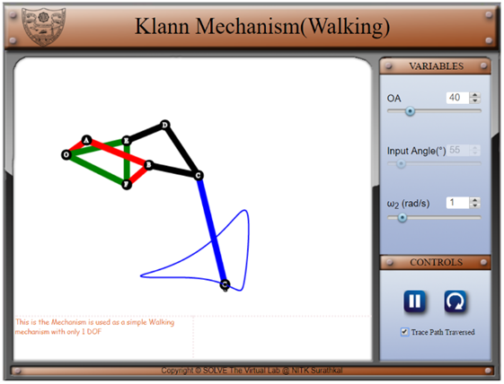

1. OA is the varied to increase Crank length.
2. The trace check box is used to trace the path followed by the leg.
3. Speed of walking can be increased by increasing the input angular velocity.

**Simulation**

In this simulation the user can vary the length of link OA. Since the link lengths are determined by specific ratios, each of the other links scale with the value of OA. The fixed link are shown in green, the first four bar mechanism is shown in red, the second four bar is shown in black and the end effector is shown in blue. The user can toggle the trace switch to see the trajectory of the end effector. This simulation runs in two modes

&nbsp;
<li>Live mode

In this mode the crank length can be changed and the angular velocity can be changed as well. The direction of the motion can also be reversed
<li>Paused mode

In this mode the simulation is static. The user can manually move the input angle to get the individual positions.