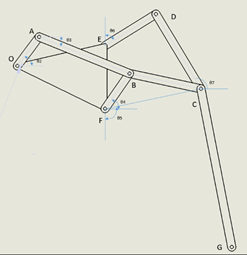
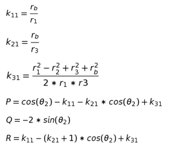
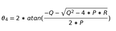
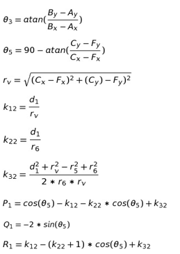
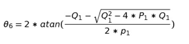

**Objectives**:

After performing the Klann Mechanism Experiment students will be able to

<li>Gain an understanding of a simple 1 degree of freedom walking mechanism.
<li>Be able to grasp the applications of coupled 4 bar mechanisms.

**Prerequisites**

<li>Knowledge of Kinematics of Four bar Mechanisms.

### THEORY

The Klann Mechanism is a planar mechanism which is designed to simulate walking in animals. It was designed to navigate uneven terrain and can also be effective on flat surfaces, capable of replacing the wheel. It is a simple system with only one degree of freedom. It was developed by Joe Klann in 1994. It is classified as a Stephenson Type 3 mechanism. The proportions of the linkage was optimized such that for the first one and a half rotations the trajectory of the end link was linear as possible while for the rest of the rotation the trajectory of the end point causes the rise of the end point to a predetermined height.

This mechanism consists of two conjoined four bar mechanism ie. the input of the second mechanism depends on the output of the first. This causes the system to be unstable if the proportion of the linkages are not constrained to a certain tolerance. It has many advantages of walking mechanisms while avoiding some of their shortcomings. Some of the advantages include the ability to traverse uneven terrain, step over stairs and obstructions and ability to have an efficient mechanism with only one degree of freedom. It does not, however, offer the control and precision that modern walking mechanisms do with higher degrees of freedom and the ability to dynamically modify its gait.

**Mathematical Model**

The system was modelled as two joined four bar mechanisms with the first mechanism being :OA – AB – BF – FO and the second mechanism being : FC – CD – DE – EF . Here the link FC was imaginary.

OA = r1

AB = r2

BF = r3

BC = r4

CD = r5

DE = r6

FC = rv

OF = rb

The first thing to do was to solve for both four bar mechanisms.

We define the variables

Solving for the variables, we get the output of the first four bar mechanism

Now we solve for the second four bar

Solving for these variables we get the output of the second four bar mechanism:

The End effector link CG is fixed such that the angle between CD and CG is 160 degrees.
